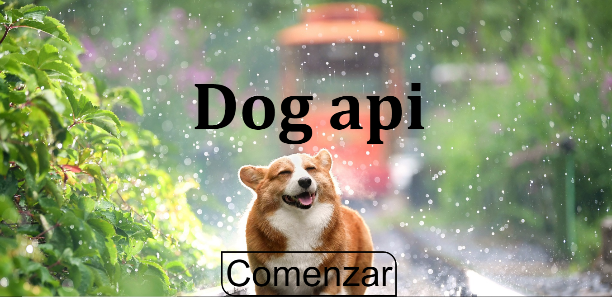
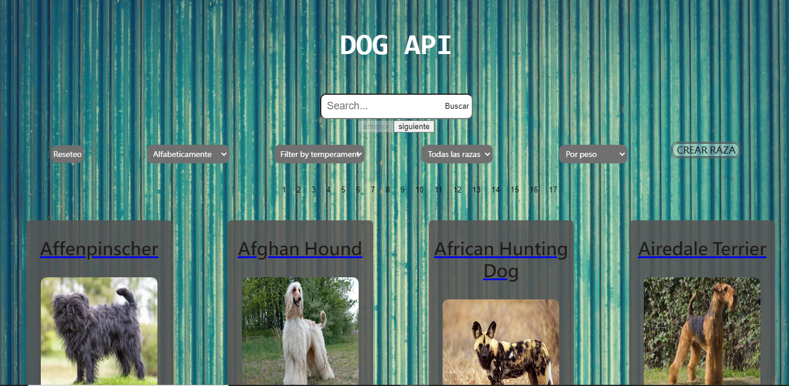
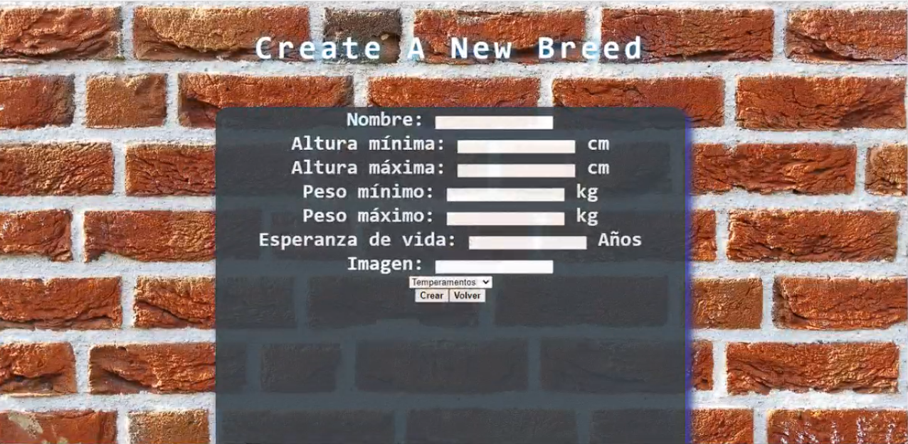
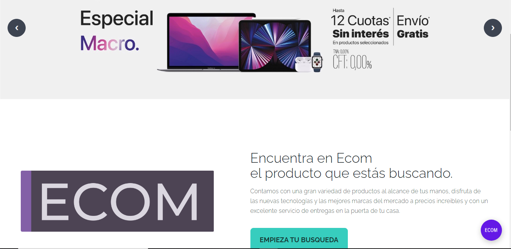
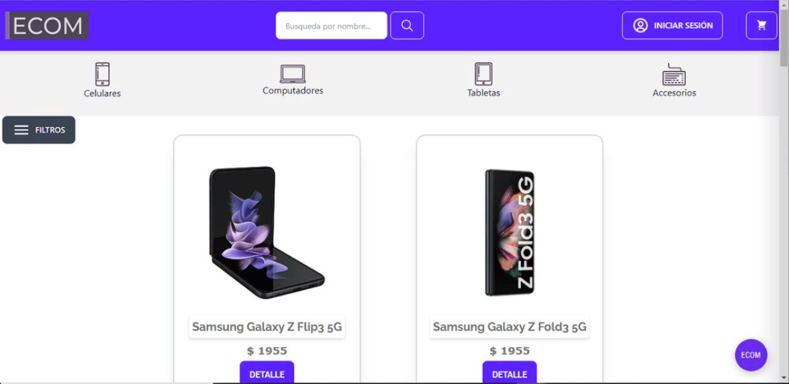

Hi there 👋, I'm Nicolas Zacarias

👤About me
I'm looking forward to my first experience working in the IT world.
I'm passionate about new challenges, generate solutions, propose new ideas, and always trying to learn something new.
⚙️Tech Skills:
🤓Javascript
💻HTML5 | CSS3 | Bootstrap
⚛️React.JS | Redux | Hooks
🛠Node.JS | Express | Sequelize
📶PostgreSQL
🐱Git | Github

📌Projects
### Dog Api (Henry Project)
  

### Ecom App
 

I’m currently searching a job to work my tech Skills.
😁Contact me!
You can contact me by sending me a message in my LinkedIn inbox or an e-mail: zacariasnicolas95@gmail.com.
linkedin github

<!---
nicolaszacarias/nicolaszacarias is a ✨ special ✨ repository because its `README.md` (this file) appears on your GitHub profile.
You can click the Preview link to take a look at your changes.
--->
